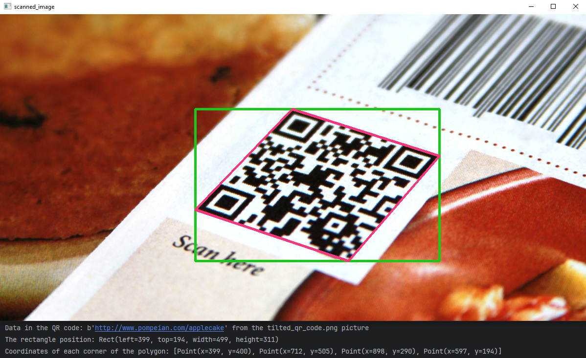

# computer-vision

### ***[Color detector](Color_detector/color_detector.py)***
A program that uses computer vision algorithms of the OpenCV library to track an object of a particular color appearing in a frame. Visual demonstration:

### ***[QR code image scanner](QR_code_image_scanner/qr_code_image_scanner.py)***
This is a program that allows to scan QR codes from images using computer vision from the openCV library and a code decoder from the pyzbar library. Demonstration of the program execution:

